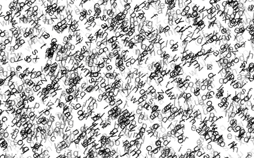

fontstash-es
============



This project is based on [fontstash](https://github.com/memononen/fontstash), it is using OpenGL ES 2.0 in order to be used on mobile devices.

You can use the following features:

+ Text-shaping using the [Harfbuzz](https://github.com/behdad/harfbuzz) text-shaping engine: this lets you render text in several directions (left-to-right, top-to-bottom...), compatible only by using the FreeType rasterizer.
+ Signed distance field rendering: for high quality anti-aliased text rendering.
+ Gl-backend: if you're not familiar with OpenGL, simply use the provided rendering system.

Activating features
-------------------

Enabling text-shaping using the freetype rasterizer:
```c++
#define FONS_USE_FREETYPE
#define GLFONTSTASH_IMPLEMENTATION
#define FONS_USE_HARFBUZZ
#import "glfontstash.h"
```

Adding fontstash-es to your project
-----------------------------------

The text-shaping feature creates a lot of dependencies and uses some static libraries in order to be used. 

If you're not planning to use the text-shaping engine, simply add the fontstash-es/include headers in your project. 

If you want to use the text-shaping engine you would need the header files from harfbuzz, freetype2 and the static libraries for these two + [ucdn](https://github.com/grigorig/ucdn) for unicode database and normalization; this for each of the different architectures you would be targetting. This project has these static libraries only for the iPhone simulator architecture (i386, x86_64).

Building examples
-----------------

For iOS, simply use the provided X-code project.

If you want to build the GLFW examples, you will need to install _GLFW_ and _CMake_, you can download it [here](http://www.cmake.org/download/) or use [homebrew](http://brew.sh/) to download everything.

```bash
brew install cmake
brew tap homebrew/versions
brew install glfw3 pkg-config
```

Then build and run the examples:
```
cd examples/glfw
cmake . && make
./glfw.out
./particles.out
```
